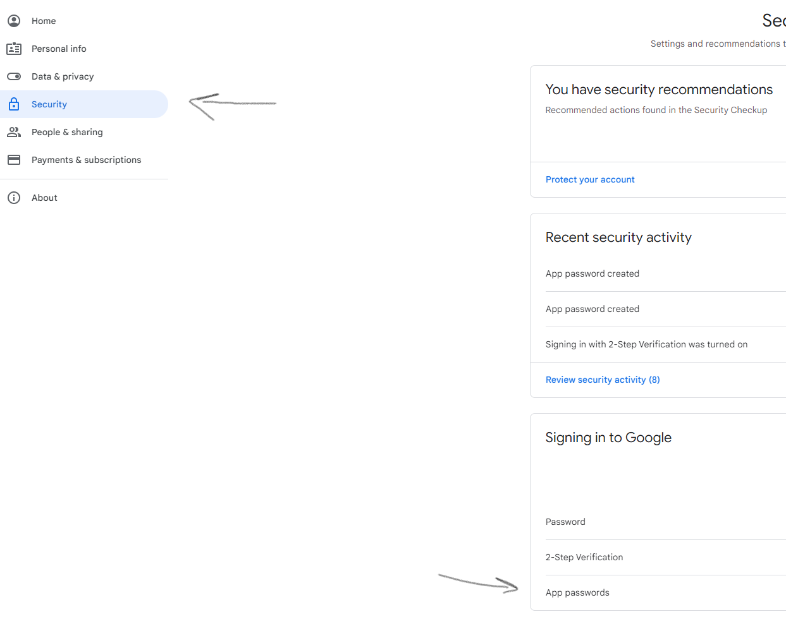

***This app is under development.  It's useful for testing out automated emailing functionality in Python with Flask, smtplib, and yagmail.***

This is a simple habit tracker flask app.  There is built in programmatic email functionality.  The app is set up to auto email the information filled out in the form.  If you want to test out emailing only, check otu the `email-scripts` sub directory and execute those files directly.

The app is called "habit tracker", but it can be used for emailing yourself or others quick reminders.  It uses a temporary list to store new entries while the app is in session.  Feel free to modify the code to connect it to a database.

For the email functionality, it's easiest to use gmail, but possible to use other email service providers.

***Set up***

It's best to create a virtual environment to execute these scripts.  You can use Conda or whatever you like to create this, pointing to the `requirements.txt` file at the root. 

To do this with conda, run:
```
conda create --name <name-of-env-you-choose>
pip install -r requirements.txt
```

You need to create a `.env` file locally at the root of the project and fill out the following:

```
EMAIL_USERNAME=''
EMAIL_PW=''
MAIL_SERVER='smtp.gmail.com'
MAIL_PORT='587'
RECIPIENT_EMAIL=''
```

Run ```python app.py``` to run app in debug mode locally

* `EMAIL_USERNAME` is the email address you want to send from.
* `EMAIL_PW` is the password for the email you're sending from.
* `MAIL_SERVER` may need to be changed if not using gmail.
* `MAIL_PORT` may need to be changed if not using gmail.
* `RECIPIENT_EMAIL` is a list of emails.  IT NEEDS TO FOLLOW THIS EXACT CONVENTION (quotation types matter): `'["xyz123@gmail.com", "abc789@gmail.com"]'`

***NOTE***
If using gmail, you need to generate an "app specific password".  To do this, go to your google account, click the cog, click "account", then click "security" on the left panel.  

You need to set up 2fa, then generate an "app specific password".  Paste this password as the value to `EMAIL_PW` in your `.env.`.



Check out this link for more detailed instructions: https://support.google.com/accounts/answer/185833?hl=en

`email-scripts/test-yagmail.py` allows for an easy custom email message IF USING GMAIL.  This convention is adoped in the Flask app.

To test out this file, simply run: 
```
python email-scripts/test-yagmail.py
```

Note: yagmail is used in the base flask app auto-email functionality. If you're using a different email service provider, you'll need to update the code in `app.py`.

`email-scripts/test-smtplib.py` is set up to send emails using Python's native `smtplib` library.  To test out this file, run: 

```
python email-scripts/test-smtplib.py
```

